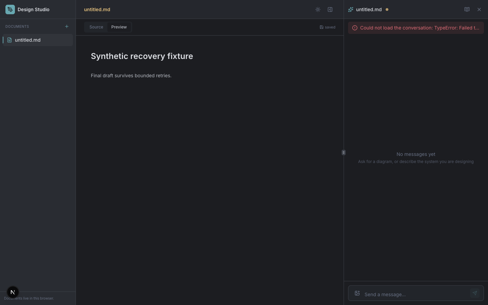

# A coding agent improves Design Studio using XState MCP

Design Studio's coding agent used real MCP observations to diagnose a failed
browser-storage save, changed the document machine, hook and component, added
regression tests, and verified recovery in the browser. The application change is
[Design Studio PR #2](https://github.com/eandualem/design-studio/pull/2).
This is the completed development demonstration tracked by
[xstate-mcp #18](https://github.com/eandualem/xstate-mcp/issues/18).

[](evidence/save-recovery.mp4)

[Watch the 34-second recording](evidence/save-recovery.mp4). It joins two real
browser-recording excerpts at normal speed: the baseline failure, then automatic
retries and recovery. The assistant panel's connection error is expected: the
fixture blocks the unused assistant-runtime connection. No in-app model request
is needed for this document-editor scenario.

## What MCP revealed and what changed

The browser showed an unsaved draft. MCP reported `open.ready` with a storage
error, no retry eligibility, and an application rejection of `user.retrySave`.
An independent IndexedDB read still returned the previous text. The coding agent
[committed this observation and its implementation decision](https://github.com/eandualem/design-studio/blob/4c8bc7983208c1f6060c126696ac054ecad8dc52/docs/save-recovery-observation.md)
**before changing save behavior**.

The machine now retries twice at 1.5-second intervals, then exposes **Retry save**.
It keeps the draft, serializes edits behind an outstanding write, ignores duplicate
retries, and clears the failure only after persistence succeeds. The hook exposes
state and actions; the component renders the recovery controls. The
[application diff](https://github.com/eandualem/design-studio/compare/e1bd77533decbb0a139c152cd5c0a8ae8d3eca81...0da1b6ae93a65c376022874f2d687f23f26352a8)
also includes development inspection and its tests.

The coding agent is the developer working on the repository. Design Studio's
in-app assistant edits design documents through assistant-runtime; it did not
write this frontend feature.

## Read the evidence

- [Actual development MCP excerpts and browser observations](evidence/development-transcript.jsonl), with phase names and original timestamps.
- [Baseline transcript](evidence/baseline-transcript.jsonl) and [unsaved draft](evidence/02-before-not-saved.png), preserved before the feature edit.
- [Independent Node 24 MCP/browser verification](evidence/node24-transcript.jsonl), including the corrected definition, rejected command, successful retry, reload and cleanup.
- [Final retry fallback on Node 24](evidence/node24-retry-exhausted.png) and [saved draft](evidence/node24-recovered.png).
- [Capture provenance and artifact hashes](evidence/manifest.json), [baseline limits](evidence/baseline-manifest.json), and [exact development-run versions](evidence/development-versions.json).

The baseline checkout contained a definition-serialization fix that its live dev
server had not loaded: that response still has omitted transition targets. The
manifest preserves this distinction. The fresh Node 24 verification reads the
final plain targets and named guards from the actual runtime. Intermediate setup
mistakes remain labeled in the transcripts; screenshots and video frames are real.

## Run the example

Use **Bun 1.4.2**, **Node 24.20.0**, and Google Chrome. The original development
capture used Node 26.8.1 and Chrome 152.0.7977.77; independent quality and live
MCP/browser checks passed on Node 24.20.0. No provider key or separate
assistant-runtime process is required by this scenario.

From a directory reserved for the demo:

```bash
git clone https://github.com/eandualem/design-studio.git design-studio-mcp-demo
cd design-studio-mcp-demo
git checkout --detach 718e1434fde306ce45aa06d273e0df2da83779ef
bun install --frozen-lockfile
bun run inspector:prepare
bunx playwright-core install ffmpeg
NEXT_PUBLIC_XSTATE_INSPECT=1 bunx next dev --port 7131
```

`inspector:prepare` builds the pinned server source in `.tmp/xstate-mcp` and installs
its browser policy build. A Git dependency alone does not provide its compiled
exports. The recorded server source is
[`16c7a0004dce3f676eab0b5606be1e3542c89449`](https://github.com/eandualem/xstate-mcp/commit/16c7a0004dce3f676eab0b5606be1e3542c89449),
a historical development snapshot from
[PR #32](https://github.com/eandualem/xstate-mcp/pull/32), preserved on
[`archive/demo-evidence/design-studio-server-16c7a00`](https://github.com/eandualem/xstate-mcp/tree/archive/demo-evidence/design-studio-server-16c7a00).
It was unmerged when captured and declares package version `1.0.1` and MCP
handshake version `1.0.0`. The evidence files retain that capture-time status and
the original versions; they do not describe the current release status.

Keep this server pin when reproducing the recording. It exposes nine tools, and
the harness launches `.tmp/xstate-mcp/dist/index.js`. At this snapshot the package
root starts the CLI; only `xstate-mcp/inspection-policy` is browser-safe. The
current checkout exposes twelve tools, has an import-safe package root, launches
the CLI through `dist/cli.js`, scopes public actor IDs by connection, and requires
hello negotiation for writes. This pinned Design Studio adapter predates that
handshake. Replacing its server with current core requires an adapter and harness
migration plus a new validation run. Use the
[frontend example](../frontend/README.md) for the current server's complete MCP
loop; the recording and Node 24 verification here cover the historical snapshot.

In another terminal in the application checkout:

```bash
EVIDENCE_DIR=.tmp/my-save-recovery node scripts/inspect-save-recovery.mjs
```

Use a new evidence directory for each run. The harness opens a fresh Chrome
profile and starts its own MCP stdio server on loopback port **7358**. Keep that
port free. It blocks assistant-runtime traffic, records each request/result and
injects storage failures only when requested. No shared agent configuration changes
are needed.

Send one JSON command per line and inspect each result before continuing:

```jsonl
{"op":"connect"}
{"op":"tools"}
{"op":"browser"}
{"op":"click","name":"New document","index":1}
{"op":"view"}
```

The explicit index selects the main **New document** button; the sidebar has the
same accessible name. Wait for the `/d/<id>` route before selecting Source:

```jsonl
{"op":"click","role":"tab","name":"Source"}
{"op":"tool","name":"get_actor_tree"}
{"op":"fault","count":3}
{"op":"edit","content":"# Synthetic recovery\n\nThis draft must survive retry.\n"}
{"op":"wait","ms":4000}
{"op":"view"}
```

The three aborted writes are the initial save and two automatic retries. The UI
should show the preserved draft and **Retry save**. Replace `DOCUMENT_SESSION_ID`
below with the actual document actor ID returned by the tree:

```jsonl
{"op":"tool","name":"get_machine_definition","arguments":{"sessionId":"DOCUMENT_SESSION_ID"}}
{"op":"tool","name":"get_actor_state","arguments":{"sessionId":"DOCUMENT_SESSION_ID"}}
{"op":"tool","name":"send_event","arguments":{"target":"DOCUMENT_SESSION_ID","event":{"type":"user.delete"}}}
{"op":"tool","name":"send_event","arguments":{"target":"DOCUMENT_SESSION_ID","event":{"type":"user.retrySave"}}}
{"op":"wait","ms":500}
{"op":"tool","name":"get_actor_state","arguments":{"sessionId":"DOCUMENT_SESSION_ID"}}
{"op":"view"}
{"op":"persisted"}
{"op":"reload"}
{"op":"view"}
{"op":"persisted"}
{"op":"tool","name":"get_actor_tree"}
```

`send_event` uses **target**; the read tools use **sessionId**. The deletion request
must be rejected by policy. Retry must be followed by `open.ready`, a cleared save
error, the saved UI and the exact draft in IndexedDB. Rediscover actor IDs after
reload. An acknowledgement alone is insufficient. With `fault` count 1, the same
flow recovers automatically without a manual click.

Finish with:

```jsonl
{"op":"unmount"}
{"op":"wait","ms":500}
{"op":"tool","name":"list_actors"}
{"op":"quit"}
```

The actor list should be empty. Stop the Next dev server with Ctrl-C. To check the
source, run `bun run lint`, `bunx tsc --noEmit`, `bun run test`, and `bun run build`.
Stop dev before the production build so they do not share an active `.next`
directory. Next needs filesystem watcher access; sandbox-denied watchers appeared
as `EMFILE` during setup here.

## Repeat the coding exercise

Start a new branch from instrumented pre-feature commit
`3087f6022b5cb9050444d928e1652e1bd06facca` and give a coding agent
[the acceptance brief](BRIEF.md). It should inspect the live failure, explain its
implementation decision, change the machine/hook/component, add tests and verify
state, UI and persistence. Follow Design Studio's own contributor instructions.

The original application baseline is `e1bd77533decbb0a139c152cd5c0a8ae8d3eca81`;
the pre-fix observation is `4c8bc7983208c1f6060c126696ac054ecad8dc52`; the feature
is `0da1b6ae93a65c376022874f2d687f23f26352a8`. The review bundle is pinned above.

## Validation and limits

All **81 tests in 11 files**, lint, TypeScript and production build passed on the
feature commit, including independent Node 24 checks. Replacing only the document
machine with the original implementation made eight of the nine new recovery
cases fail. Real browser/MCP runs cover automatic/manual recovery, rejected writes,
persisted reload, reconnect replay, one live actor system, HMR/unmount cleanup,
and zero production inspection sockets. The independent Node 24 run also verified
actual release of its two server ports after teardown.

Inspection is opt-in in development and disabled in production. Server and adapter
allow only the narrow demo commands; the adapter validates actual actor ownership,
payload shape and runtime eligibility, and redacts before transfer. Synthetic
IndexedDB transaction aborts are test fixtures. MCP data can reach the coding
client's provider and logs, so use synthetic documents throughout.

The coding agent ran in Codex CLI and identified itself as GPT-6. Exact deployment
identity, usage and cost were unavailable; zero in-app model calls is not a
zero-cost claim for the coding agent. The
[current release guide](../../docs/releases.md) describes the integrated server;
the [general adapter](https://github.com/eandualem/xstate-mcp/issues/13) remains
separate work. The application change is reviewed in Design Studio PR #2; this
repository's demo does not merge or publish that application. This demo's HMR
remounts from persisted data and does not preserve an unsaved draft across a code
update.
