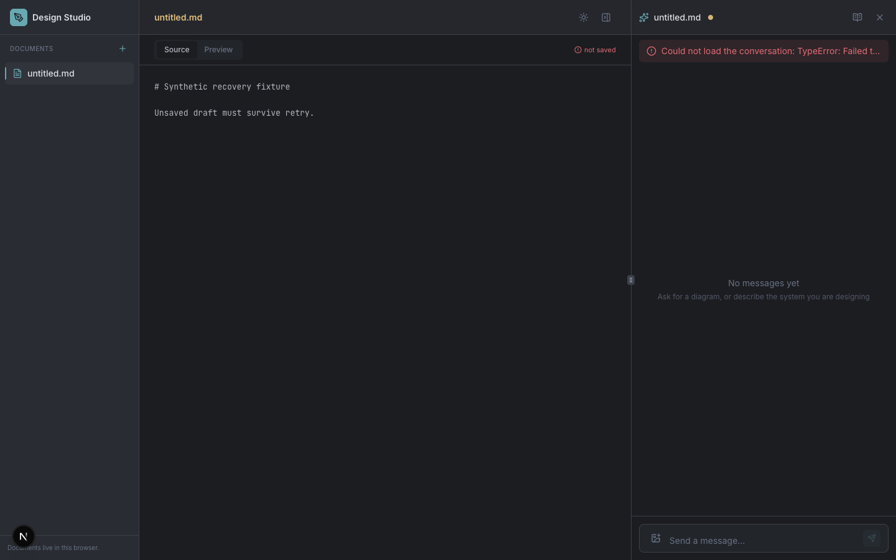

# Design Studio develops save recovery with MCP evidence

This demonstration follows the coding agent assigned to
[Design Studio](https://github.com/eandualem/design-studio) as it improves a real
frontend. The in-app assistant and assistant-runtime are separate participants;
this scenario exercises the document editor without an in-app model request.

**Status:** development instrumentation and the baseline failure are captured.
Recovery implementation and the final recording are in progress in [Design Studio #1](https://github.com/eandualem/design-studio/issues/1).
This guide records preparation and actual baseline evidence. It does not yet claim
a completed recovery demonstration. See [the acceptance brief](BRIEF.md),
[xstate-mcp #18](https://github.com/eandualem/xstate-mcp/issues/18), and
[the integration PR](https://github.com/eandualem/xstate-mcp/pull/34).

## The question the demonstration must answer

When an IndexedDB save fails, Design Studio retains the draft and displays “not
saved.” At baseline `e1bd77533decbb0a139c152cd5c0a8ae8d3eca81`, the document machine
and hook expose no save-retry action. The coding agent must reproduce that behavior
through the browser, use MCP state/definition/history observations to understand
it, then implement and verify bounded retry with a visible recovery action.

A successful command acknowledgement alone does not prove that the draft reached
storage. The final proof must include successful save state, matching rendered UI,
and the persisted document reopened after a reload.

## Captured baseline

The coding agent used the interactive MCP/browser harness before changing the
save behavior. At instrumented source commit
[`99513db`](https://github.com/eandualem/design-studio/commit/99513dbf6b666eecd0e779d8970424a26ca47397),
the document machine, hook and component still match the original baseline.

The [actual transcript](evidence/baseline-transcript.jsonl) records an injected
IndexedDB transaction abort, followed by these observations:

- `get_actor_state`: `open.ready`, with `saveError: "Storage write failed"`.
- `can_handle_event`: `user.retrySave` cannot be handled.
- `send_event`: the application rejects `user.retrySave`.
- The browser displays “not saved” and retains the new draft in the editor.
- Reading IndexedDB still returns the previous text, “Persisted baseline.”



The assistant panel's connection error is expected: the fixture blocks the unused
assistant-runtime connection and makes no in-app model call. It is separate from
the document save failure being investigated.

[Capture metadata and SHA-256 hashes](evidence/baseline-manifest.json) identify the
source, real server runtime and timestamps. Screenshot paths in the transcript
were shortened to filenames; screenshots are unchanged, and document content is
synthetic. This is baseline evidence. Successful recovery, final checks and the
short recording are still required.

## Prepare the pinned server

Use Node **24.20.0** and Bun **1.4.2**. These commands create a separate checkout;
run them in a directory reserved for the demo:

```bash
git clone https://github.com/eandualem/xstate-mcp.git xstate-mcp-demo-server
cd xstate-mcp-demo-server
git checkout --detach 16c7a0004dce3f676eab0b5606be1e3542c89449
bun install --frozen-lockfile
bun run build
git rev-parse HEAD
cd ..
```

This source includes [PR #32](https://github.com/eandualem/xstate-mcp/pull/32)'s
server write policy and browser-safe `xstate-mcp/inspection-policy` export. Use the
source commit to identify it: it still declares package version `1.0.1` and reports
MCP server version `1.0.0`. It is an **unmerged development build**, with no new npm
release. The independent release, dependency and factory changes are not bundled.

At this commit the executable is `dist/index.js`. Import only the policy subpath
from browser code; importing the root starts the server. A git dependency alone
is insufficient if its build scripts have not produced `dist/`. The application
setup must explicitly build or install a verified artifact of this pinned source.

The server defaults to application read-only mode. Configure paired actor/event
allow rules for only the commands the demonstration needs, and enforce the same
or narrower rules adjacent to application dispatch. Read the pinned checkout's
`docs/write-controls-and-redaction.md` for the actual configuration contract.

## Evidence requirements

The application run must record a separate instrumentation commit, a baseline MCP
session and UI failure captured before the recovery edit, the agent's resulting
implementation decision, and the final application commit and passing checks.
The final artifacts must include actual MCP requests/results, before/after UI,
a rejected or failing action, recovery, reload persistence, and a short recording.

Use only synthetic documents in a fresh browser profile. Explicitly label injected
storage faults, automatic regression replays and any edited video. Redact inspection
data before transfer and inspect the final files before sharing. Coding-client
providers and logs may receive MCP data even though this server has no telemetry.

The document scenario makes no paid assistant-runtime model request. The coding
agent itself uses its configured runtime and model; record those separately and
report cost or token usage only if available. A missing usage report is not a
zero-cost measurement.
