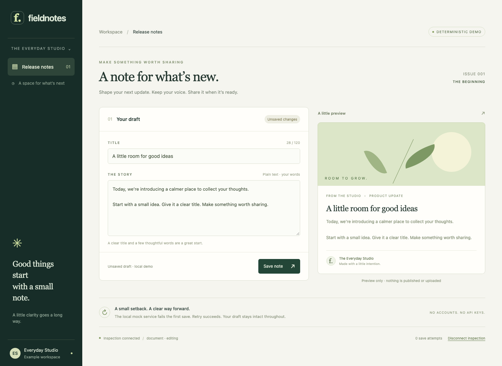
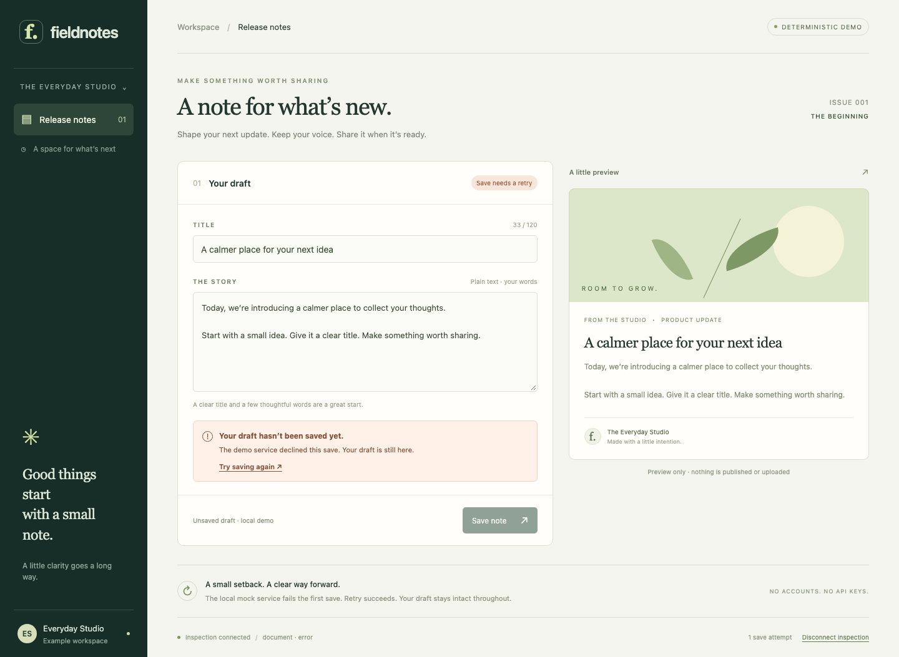
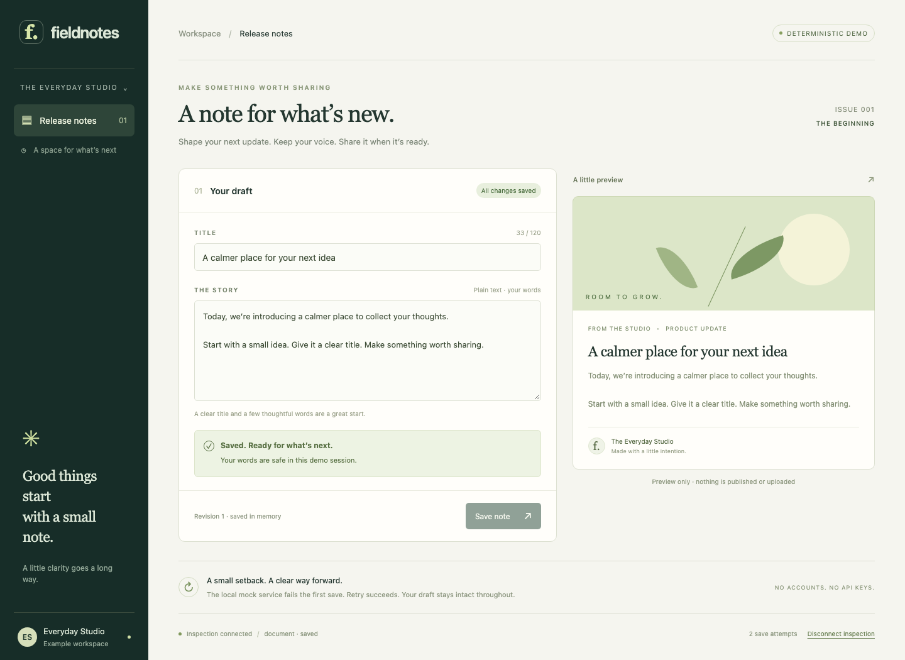
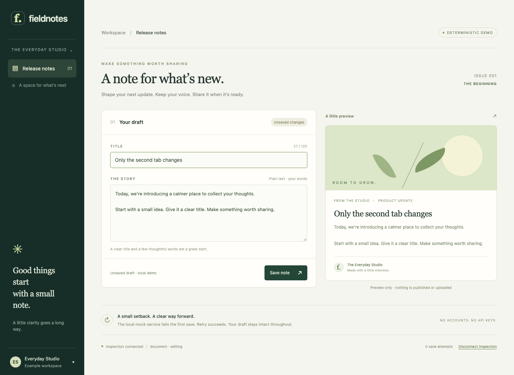
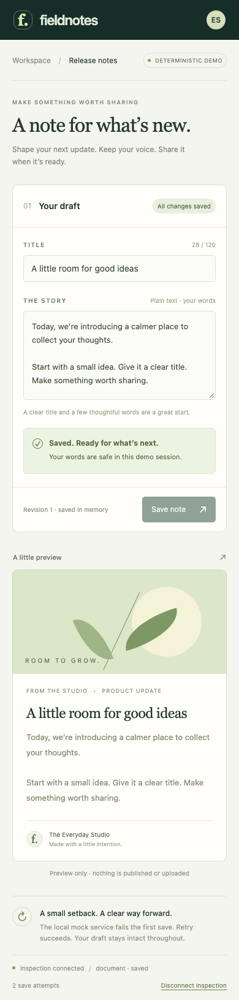

# Captured MCP and browser evidence

These are outputs of the deterministic test client and real Chromium browser,
using the repository's built MCP CLI and the example's actual XState actors.
They are not a model conversation or a recording of an agent writing code.
The asynchronous save service is a local mock: attempt one fails; retry succeeds.

The JSON files record the source commit, SHA-256 hashes of runtime/test files,
exact Node/browser/dependency versions, real MCP tool arguments/results and browser
checkpoints. `screenshot` fields point to the PNGs beside them. Actor IDs are
consistently aliased by tab/generation. The fixture token was checked against raw
inspection frames and MCP results before sanitizing the transcript.

- [Complete MCP loop](mcp-loop.json): discovery, parent/child definitions, state,
  eligibility, save ACK followed by a failed snapshot, forbidden event rejection,
  retry ACK followed by a saved snapshot, history/timeline/resource/prompt reads.
- [Reconnect and two tabs](sessions.json): edit while inspection is disconnected,
  replay latest state, refresh, reject an ambiguous name, and target only tab two.
- [Mobile and production](mobile-production.json): recover with visible controls
  on a 390-pixel viewport and verify the production bundle opens no WebSocket.

## Before saving

## Intentional failure, draft preserved

## MCP retry, state and UI agree

## Reconnect and isolated second tab

## Mobile recovery

Reproduce with the [clean-clone commands](../README.md#clean-clone-verification).
Fresh captures are written under `test-results/`; CI retains the report and
artifacts for 14 days. These checked-in screenshots are a selected successful run,
not pixel-perfect golden images. Browser assertions check behavior and layout
rather than comparing font rendering across operating systems.
